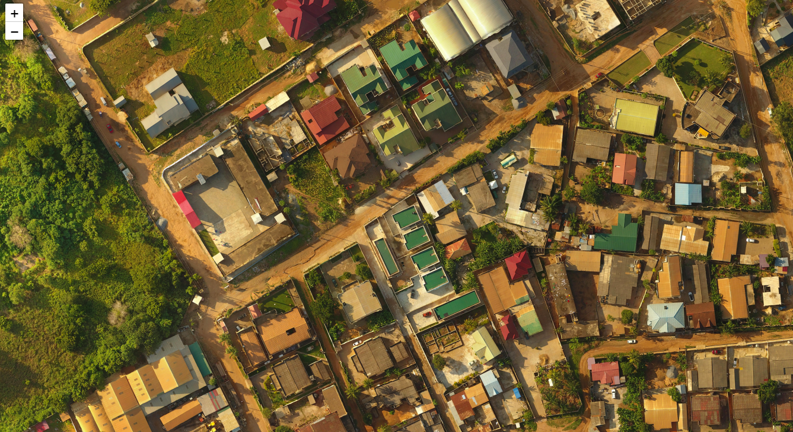
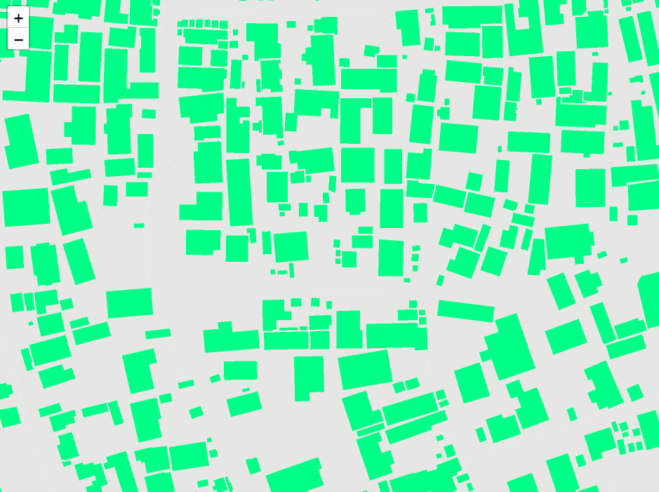
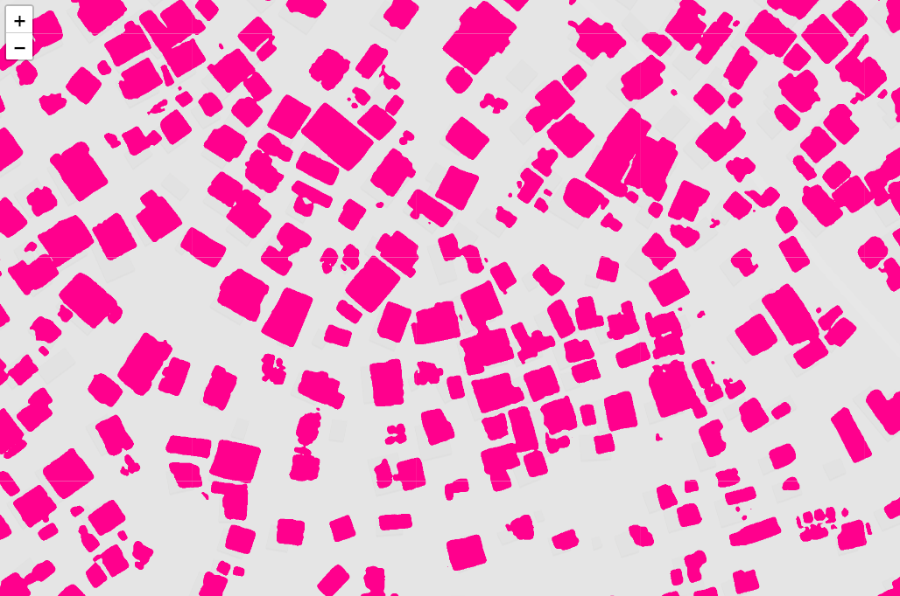
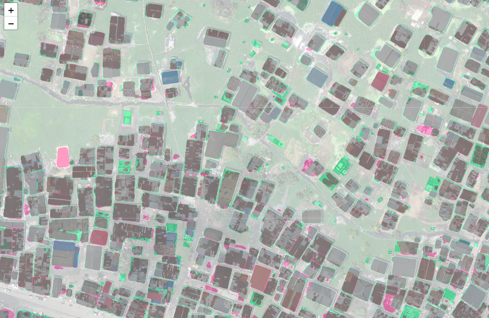
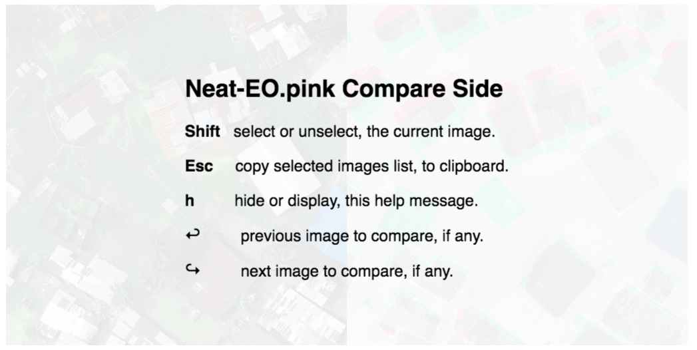

# Neat-EO.pink 101


Check Neat-EO.pink installation and GPU
---------------------------------------
```bash
neo info
```

Retrieve DataSet (Subset of <a href="https://www.drivendata.org/competitions/60/building-segmentation-disaster-resilience">Open Cities AI Challenge 2020</a>)
---------------------------------
```bash
wget -nc http://www.datapink.net/neo/101/ds.tar
tar xf ds.tar
```

Configuration file:
-------------------

```bash
echo '
[[channels]]
  name   = "images"
  bands = [1, 2, 3]

[[classes]]
  title = "Background"
  color = "transparent"

[[classes]]
  title = "Building"
  color = "deeppink"

[model]
  nn = "Albunet"
  loader = "SemSeg"
  encoder = "resnet50"

[train]
  bs = 4
  loss = "Lovasz"
  da = {name="RGB", p=1.0}
  optimizer = {name="Adam", lr=0.000025}
  metrics = ["QoD"]

' > 101.toml


export NEO_CONFIG=101.toml
```


Tile Imagery:
-------------
```bash
neo tile --zoom 19 --bands 1,2,3 --nodata_threshold 25 --rasters train/*/*[^-]/*tif --out train/images

```
<a href="http://www.datapink.net/neo/101/train/images/"></a>


Retrieve and tile labels accordingly: 
-------------------------------------

```bash
neo cover --dir train/images --out train/cover.csv
neo rasterize --geojson train/*/*-labels/*.geojson --type Building --buffer -0.25 --cover train/cover.csv --out train/labels
```
<a href="http://www.datapink.net/neo/101/train/labels/"></a>


Launch training :
-----------------

```bash
neo train --dataset train --epochs 5 --out model
neo eval --checkpoint model/checkpoint-00005.pth --dataset train
```


Retrieve, prepare and predict on a new imagery:
-----------------------------------------------
```bash
neo tile --zoom 19 --bands 1,2,3 --nodata_threshold 25 --rasters predict/*/*[^-]/*tif --out predict/images
neo predict --checkpoint model/checkpoint-00005.pth --dataset predict --metatiles --out predict/masks
```
<a href="http://www.datapink.net/neo/101/predict/masks/leaflet.html"></a>


Compare our trained model prediction against labels:
----------------------------------------------------
```bash
neo cover --dir predict/masks --out predict/cover.csv
neo rasterize --geojson predict/*/*-labels/*.geojson --type Building --cover predict/cover.csv --out predict/labels
neo compare --mode stack --images predict/images predict/labels predict/masks --cover predict/cover.csv --out predict/compare
neo compare --mode list --labels predict/labels --masks predict/masks --max Building QoD 0.80 --cover predict/cover.csv --geojson --out predict/compare/tiles.json
```
<a href="http://www.datapink.net/neo/101/predict/compare/"></a>

```bash
neo compare --mode side --labels predict/labels --masks predict/masks --max Building QoD 0.80 --images predict/images predict/compare --cover predict/cover.csv --out predict/compare_side
```
<a href="http://www.datapink.net/neo/101/predict/compare_side/"></a>
